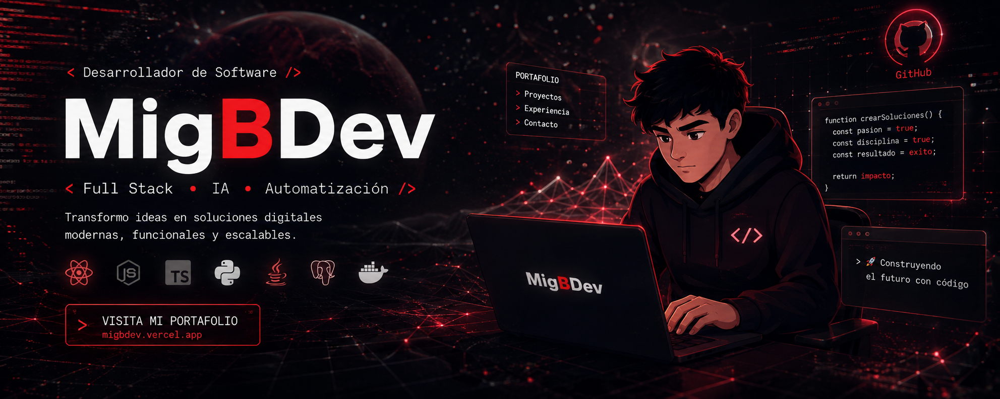

  

  

<!-- Divisor animado -->

<!-- SOBRE MÍ en fuente videojuego y color verde -->
<h2 align="center">
  
</h2>

<!-- Texto descriptivo en fuente consola -->

 Tecnólogo en Desarrollo de Software con experiencia en proyectos aplicando tecnologías como Python, Java, Node.js, React, HTML, CSS, MySQL y PostgreSQL. He desarrollado interfaces web funcionales y trabajado en la creación de APIs y servicios backend, aplicando buenas prácticas de diseño, estructuras limpias y metodologías ágiles como Scrum.

  Manejo herramientas como Docker y he explorado frameworks como Flask y FastAPI para el desarrollo de servicios modernos. Me interesa la automatización, la inteligencia artificial aplicada y construir soluciones que realmente resuelvan problemas.

  Me motiva aprender de forma constante, estar al día con las tecnologías emergentes y participar en proyectos donde pueda aportar valor, aprender en equipo y seguir evolucionando como desarrollador.

<!-- Título SKILLS estilo videojuego -->
<h2 align="center">
  
</h2>

<h4 align="center" style="color: #39FF14; font-family: 'Share Tech Mono', monospace;">
  Lenguajes y herramientas
</h4>

  
  
  
  
  
  
  
  
  
  
  
  
  
  

<!-- Snake animation -->

  

